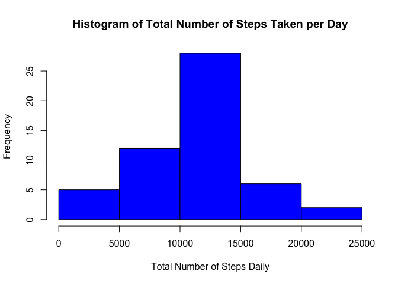
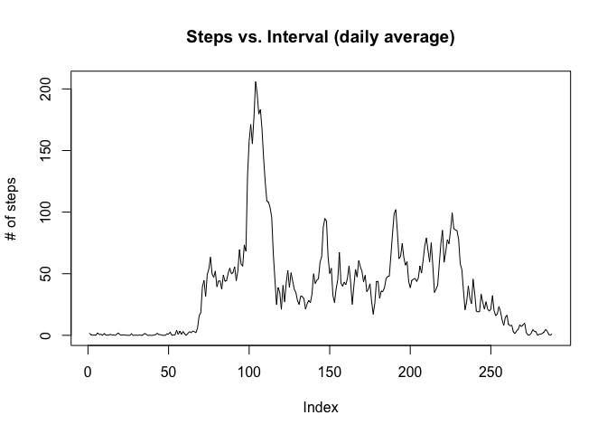
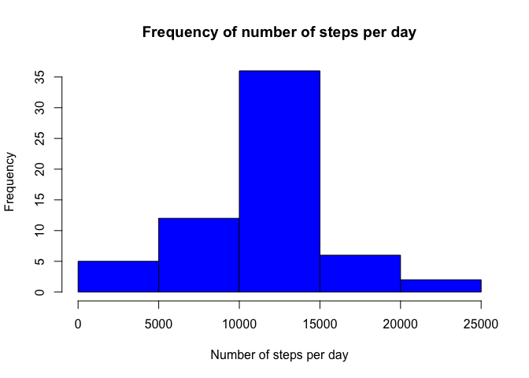
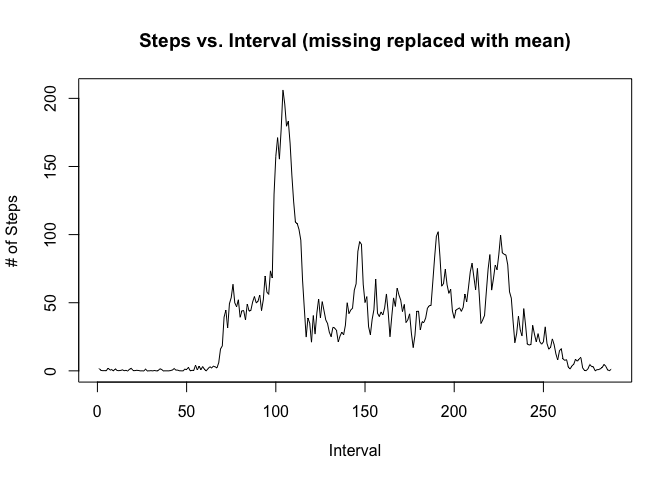

# Reproducible Research: Peer Assessment 1


## Loading and preprocessing the data

```r
# Load the data
setwd("~/Desktop")
sports_data <- read.csv("activity.csv", head=TRUE)
```


## What is mean total number of steps taken per day?

```r
# Calculate the total number of steps taken per day
daily_total_steps <- aggregate(sports_data[, 1], list(sports_data$date), sum)
colnames(daily_total_steps) <- c("date", "daily_total_steps")
daily_total_steps$daily_total_steps
```

```
##  [1]    NA   126 11352 12116 13294 15420 11015    NA 12811  9900 10304
## [12] 17382 12426 15098 10139 15084 13452 10056 11829 10395  8821 13460
## [23]  8918  8355  2492  6778 10119 11458  5018  9819 15414    NA 10600
## [34] 10571    NA 10439  8334 12883  3219    NA    NA 12608 10765  7336
## [45]    NA    41  5441 14339 15110  8841  4472 12787 20427 21194 14478
## [56] 11834 11162 13646 10183  7047    NA
```

```r
# Make a histogram of the total number of steps taken each day
hist(daily_total_steps$daily_total_steps, 
     main = "Histogram of Total Number of Steps Taken per Day",
     xlab = "Total Number of Steps Daily",
     col="Blue"
     )
```

 

```r
# Calculate the mean of the total number of steps taken per day
round(mean(daily_total_steps$daily_total_steps, na.rm = TRUE), 0)
```

```
## [1] 10766
```

```r
# Calculate the median of the total number of steps taken per day
median(daily_total_steps$daily_total_steps, na.rm = TRUE)
```

```
## [1] 10765
```


## What is the average daily activity pattern?

```r
# Make a time series plot
stepsMeanPerInterval <- tapply(sports_data$steps, sports_data$interval, 
                               mean, na.rm = T)
summary(stepsMeanPerInterval)
```

```
##    Min. 1st Qu.  Median    Mean 3rd Qu.    Max. 
##   0.000   2.486  34.110  37.380  52.830 206.200
```

```r
plot(stepsMeanPerInterval, type = "l", 
     main = ("Steps vs. Interval (daily average)"), 
     ylab = "# of steps")
```

 

```r
# Which 5-minute interval, on average across all the days in the dataset, 
# contains the maximum number of steps?
seq(along = stepsMeanPerInterval)[stepsMeanPerInterval == max(stepsMeanPerInterval)]
```

```
## [1] 104
```


## Imputing missing values

```r
# the total number of rows with NAs
summary(sports_data$steps)[7]
```

```
## NA's 
## 2304
```

```r
#
# Get the steps mean per interval as a vector
tmp_stepsMeanPerInterval <- as.vector(stepsMeanPerInterval)
# Repeat it to be the same for each of the 61 days
tmp_stepsMeanPerInterval <- rep(tmp_stepsMeanPerInterval, 61)
# Set it one where there is no missin data
tmp_stepsMeanPerInterval[!is.na(sports_data$steps)] = 1

# Get the steps data as a vector
tmp_dataTest <- as.vector(sports_data$steps)
# Set it to one where data is missing
tmp_dataTest[is.na(tmp_dataTest)] = 1

data_NoMissing <- sports_data
data_NoMissing$steps <- tmp_stepsMeanPerInterval * tmp_dataTest

stepsTotalPerDay_NoMissing <- tapply(data_NoMissing$steps, data_NoMissing$date, 
                                     sum)
# Make a new hisogram 
hist(stepsTotalPerDay_NoMissing, breaks = 6, 
     main = "Frequency of number of steps per day", 
     xlab = "Number of steps per day", ylab = "Frequency", col = "blue")
```

 

```r
# The spike in the middle of the histogram has increased due to the filling in
# missing value in the dataset

stepsMeanPerInterval_NoMissing <- tapply(data_NoMissing$steps, 
                                         data_NoMissing$interval, mean)

mean(stepsTotalPerDay_NoMissing)
```

```
## [1] 10766.19
```

```r
median(stepsTotalPerDay_NoMissing)
```

```
## [1] 10766.19
```

```r
plot(stepsMeanPerInterval_NoMissing, type = "l", xlab = "Interval", 
     ylab = "# of Steps", 
     main = "Steps vs. Interval (missing replaced with mean)")
```

 


## Are there differences in activity patterns between weekdays and weekends?

